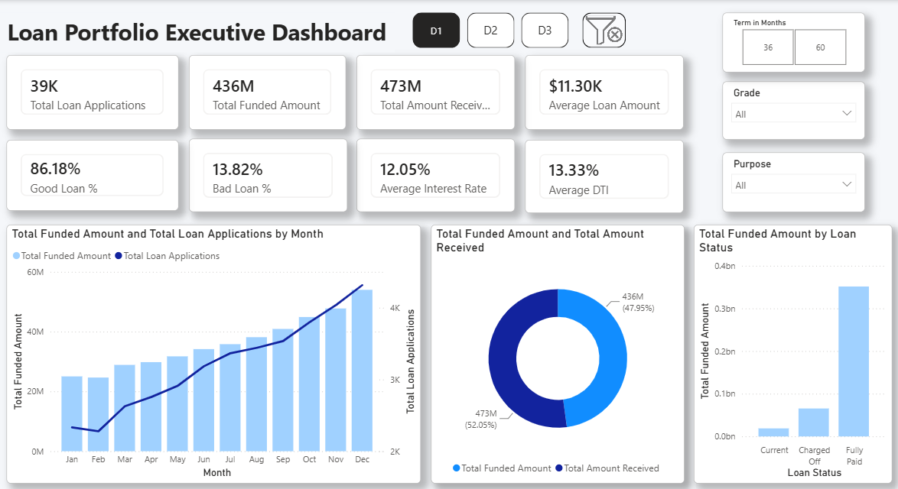
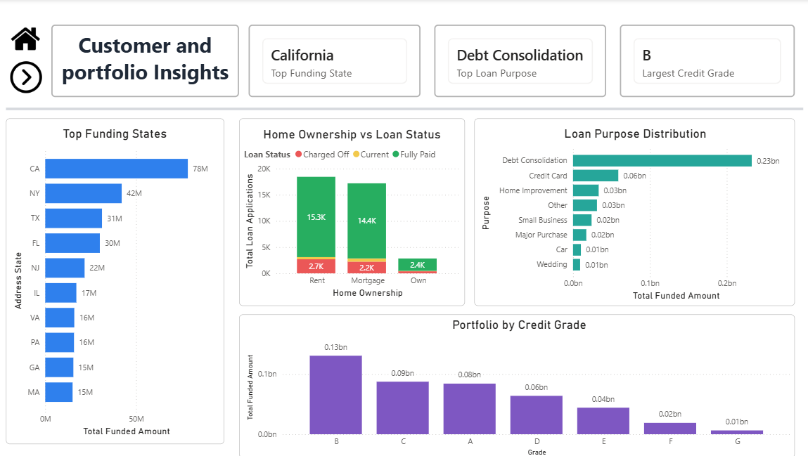
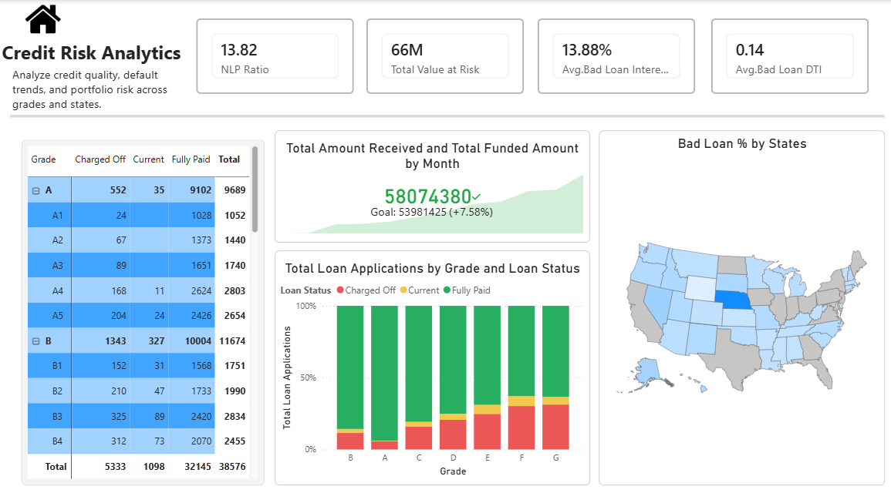

# Financial Credit Risk Analytics Dashboard

## 📌 Executive Business Problem
Financial institutions face critical revenue losses due to loan defaults. This project transforms raw banking loan applications into an actionable underwriting intelligence suite. It optimizes the balance between risk mitigation and capital growth by isolating non-performing loans (NPLs) and bad debt trajectories.

---

## 📊 Dashboard Architecture & Insights

### 1. Executive Dashboard
*   **Purpose:** Comprehensive overview of total applications, funded amounts, and cash streams.
*   **Recruiter Summary Note:** Features high-level KPIs showcasing dynamic month-over-month (MoM) calculations tracking healthy vs. delinquent applications.

### 2. Customer Portfolio Insights
*   **Purpose:** Granular deep dive into demographic segmentation, geographic distributions, and purpose-of-loan metrics.
*   **Recruiter Summary Note:** Highlights structural risk pockets across regions and correlates employment tenure with default rates.

### 3. Credit Risk Analytics Matrix
*   **Purpose:** Deep technical isolation of "Good Loans" vs. "Bad Loans".
*   **Recruiter Summary Note:** Dynamically isolates high-risk grades (such as Grade G and F loans) allowing loan officers to audit active repayment velocity.

---

## 🛠️ Data Engineering & Modeling

### The Data Model
A strictly optimized **Star Schema** architectural design was executed to enforce filter propagation efficiently and prevent calculation ambiguity.

*   **Fact Table:** `Fact_Loan_Data` (Loan metrics, status, finances)
*   **Dimension Tables:** `Dim_Geography`, `Dim_Customer_Demographics`, `Dim_Calendar`

---

# 📈 Key Insights

- Most loans were successfully repaid, resulting in a healthy loan portfolio.
- California received the highest total funded amount.
- Debt Consolidation was the most common loan purpose.
- Grade B accounted for the largest share of funded loans.
- Charged-off loans represented a relatively small portion of the portfolio but highlighted areas of increased credit risk.
- Loan funding and applications showed consistent growth throughout the year.

---

# ⚙️ Skills Demonstrated

- Power BI
- Power Query
- Data Cleaning
- Data Modeling
- Star Schema Design
- DAX Calculations
- KPI Development
- Financial Analytics
- Interactive Dashboard Design
- Business Intelligence
- Data Visualization

---

# 🧮 Key DAX Measures

- Total Loan Applications
- Total Funded Amount
- Total Amount Received
- Average Interest Rate
- Average DTI
- Good Loan Applications
- Bad Loan Applications
- Good Loan %
- Bad Loan %
- Total Value at Risk
- Non-Performing Loan Ratio (NPL)

---

# 🚀 Tools & Technologies

- Microsoft Power BI
- Power Query
- DAX
- Microsoft Excel

---

## 🧮 DAX Measures

This project includes custom DAX measures for KPI calculation, loan segmentation, and risk analysis.

📄 See **[DAX_Measures.md](DAX_Measures.md)** for the complete list of measures and formulas.

---

## 👤 Author

**Anusha**

Aspiring Data Analyst | Power BI | SQL | Python

If you found this project helpful, feel free to ⭐ the repository.
